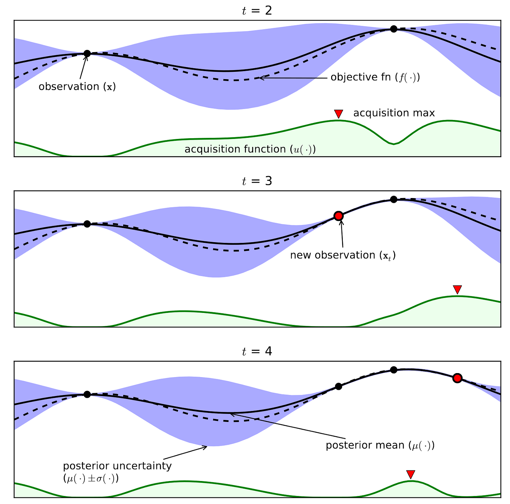
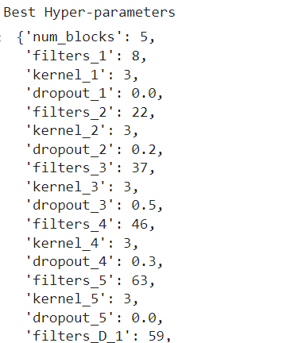
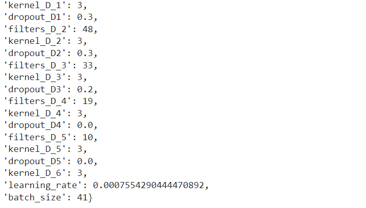
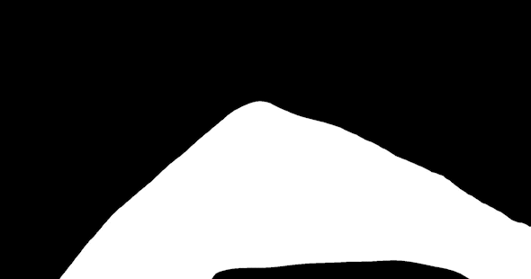

# **Lane Detection for Autonomous Vehicles: Image Segmentation with Bayesian Optimization using Keras Tuner**

### Objective:
*	The project's aim is to detect and segment ***'lanes'*** from images, aiding autonomous vehicles in maintaining a consistent lane position.
*	Deep learning techniques, ***'image segmentation'***, is employed to accurately identify and extract lanes within images.  
*	The project utilizes ***'Bayesian optimization'***, a powerful method, to obtain optimal hyperparameter configuration.
* The '***Keras tuner library'***, a Python library, is utilized to perform Bayesian optimization and fine-tune the hyperparameters.

<p align='center'>

</p>
<br>

# **1. Dataset**
The dataset for this project is manually created by capturing day and night videos of roads at our IIT Roorkee Campus. Images are extracted from the frames of these videos.
<p align='center'>
          
          
</p>

## Labelling
These images are manually labelled using the LabelME software. A polygon-shaped annotation is added to depict the outline of the lane portion within the image. Around 900 images are Labelled.

<p align="center">

</p>

### Converting to Binary Image:
The labelling process generates JSON files in which the lane outlines are stored as polygon coordinates. For training, a 2D matrix is required, with values of 1 indicating the lane portion and 0 representing the background. Therefore, the JSON files were converted into binary images for further processing.(Refer [Json mask to binary image.ipynb](Json%20mask%20to%20binary%20image.ipynb) notebook)

<table align='center'>
  <tr>
    <td align="center">Json Label</td>
    <td align="center">Binary Image</td>
  </tr>
  <tr>
    <td></td>
    <td></td>
  </tr>
 </table>
 
<br>

# **2. Training and Optimization**
(Refer [Training using keras tuner.ipynb](Training%20using%20keras%20tuner.ipynb) notebook)
<h2> <strong>(a) Bayesian Optimization: Hyper Parameter Tuning</strong></h2>

*	Hyperparameters in CNN models impact architecture, training, and performance.
*	Bayesian optimization optimizes CNN models by tuning their hyperparameters to maximize performance.
*	Examples of CNN hyperparameters include learning rate, batch size, number of layers, filter sizes, and dropout rates. Bayesian optimization finds the best configuration.

It works on three main functions:
1.	Black box objective function: Function for the performance metric used to evaluate the CNN model w.r.t. given input hyperparameter configuration.
2.	Surrogate Function: Bayesian optimization utilizes a surrogate probabilistic model to approximate the unknown objective function, capturing uncertainty and estimating it across the hyperparameter space by trials.
3.	Acquisition function: Guides the selection of the next hyperparameter configuration, balancing exploration of uncertain regions and exploitation of promising regions for improved results.

<p align='center'>

</p>
<br>

### **Perfomance Metrices and Loss Function**
**Metrics** : 
<table align="center">
  <tr>
    <td></td>
    <td></td>
  </tr>
  <tr>
    <td align="center">Intersection over union</td>
    <td align="center">F1 score/dice coeffienct</td>
  </tr>
 </table>
 
**Loss function** : Jaccard loss(1-IoU) + Categorical Focal loss

Categorical Focal loss:<br>
$${L}\left({y,y'}\right)=-\sum_{i = 1}^{C}{α_i}\left({1-y'_i}\right)^{γ}{log(y'_i)}$$

<p align ='right'>
C : the total number of classes, &nbsp;  αi : class balancing factor for class i.<br> γ : focusing parameter,emphasize hard-to-classify examples.
</p>


<h2> <strong>(b) Keras Tuner</strong></h2>

*	Keras Tuner is a Python library for Keras models, providing a user-friendly interface.
*	It supports automated search algorithms such as Bayesian optimization, Hyperband, and Random Search algorithms to explore the hyperparameter space.
*	Keras Tuner simplifies the process of hyperparameter tuning, resulting in time and effort savings.

Install and Import KerasTuner 
```ruby
pip install keras-tuner
import keras_tuner
```
A function is written to create and return a Keras model, with the hyperparameters defined using the hp argument.
```ruby
def create_model(hp):
    ...
    num_blocks = hp.Int('num_blocks', 3,5)
    for i in range(num_blocks):
        hp_filters=hp.Int('filters_'+ str(i+1), min_value=8, max_value=64)
        hp_kernel=hp.Choice('kernel_'+ str(i+1), values=[3,5])
        model.add(Conv2D(hp_filters, (hp_kernel,hp_kernel), padding='same', activation='relu', kernel_initializer='he_uniform'))
        model.add(Dropout(hp.Choice('dropout_'+ str(i+1), values=[0.0, 0.2,0.3,0.4,0.5])))
    ...
```
The tuner is initialized, with the ‘objective’ being specified to select the best models, and max_trials determining the number of different models to try.
```ruby
tuner = kt.tuners.BayesianOptimization(
   create_model,
   objective='val_loss',
   max_trials=15
)
```
Start the search and get the best model and best hyperparameters:
```ruby
tuner.search(X_train, y_train, validation_data=(X_test, y_test), epochs = 10, callbacks=[tf.keras.callbacks.EarlyStopping('val_loss', patience=3)])
best_hyperparameters = tuner.get_best_hyperparameters(1)[0]
```
<p align='center'>

</p>


### Training with Best hyperparameters

```ruby
best_model = tuner.get_best_models()[0]
```
Best Model was trained again for 50 epochs.

### **Results**
**Train results-** Loss: 0.0604, IoU: 0.9148, F1 Score: 0.9555
<p align='center'>

</p>

### Prediction on test data:
**Test Results-** Loss: 0.0574, IoU: 0.9236, F1 Score: 0.9603
<p align='center'>

</p>

<br>

# **3. Testing on Input Video using *'opencv'***

Model is used on Video with the help of \`*opencv\`* library (refer [Video Testing.ipynb](Video%20Testing.ipynb) notebook)
1. The video file is loaded using OpenCV's *\`VideoCapture\`* function, extracting frames one by one for further processing.
2. Each frame is passed through a trained CNN Lane segmentation model to predict and extract the lane region.
3. Using the \`*VideoWriter\`* function, a new video file is created to store the segmented frames. Each segmented frame is added to the video file, and finally, it is saved to a specified location.

Result out the video is given below:

<p >

</p>

<p align='center'>

</p>


